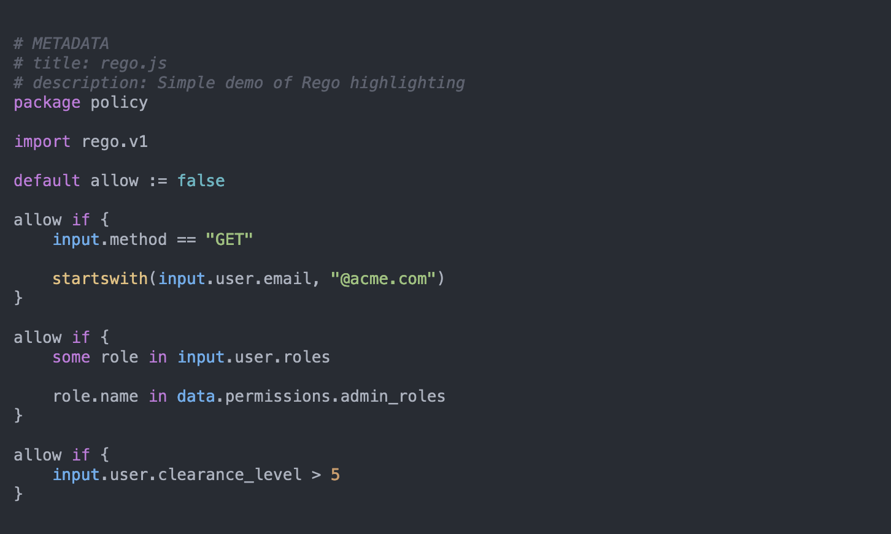

# highlightjs-rego

[highlight.js](https://highlightjs.org/) syntax highlighting for the
[Rego](https://www.openpolicyagent.org/docs/latest/policy-language) language of Open Policy Agent (OPA).



## How to use

Head over to the [releases](https://github.com/StyraInc/highlightjs-rego/releases) page and grab the minified version of
the Rego syntax definition file (`rego.min.js` or `rego.es.min.js`). Include it in your HTML file, and use the
`language-rego` class for the `<code>` block you want to highlight:

```html
<!DOCTYPE html>
<html>
<head>
  <title>Highlight.js Rego Demo</title>
  <link rel="stylesheet" href="path/to/theme.css">
  <script type="text/javascript" src="path/to/highlight.min.js"></script>
  <script type="text/javascript" src="path/to/rego.min.js"></script>
  <script type="text/javascript">hljs.highlightAll();</script>
</head>

<body>
  <pre><code class="language-rego">
# METADATA
# description: Your Rego policy here!
package policy

default allow := false

allow if {
    # ..conditions..
}
  </code></pre>
</body>

</html>
```

## How to build

Building from source can either be done by running the `build.sh` script in this repository, or manually
following the steps below.

1. Clone the highlight.js repository
   ```
   git clone https://github.com/highlightjs/highlight.js.git
   ```
2. Clone this repository
    ```
    git clone https://github.com/StyraInc/highlightjs-rego.git
    ```
3. In the `extra` directory of the highlight.js repository, create a symlink to this repository
    ```shell
    ln -s /path/to/highlightjs-rego /path/to/highlight.js/extra/highlightjs-rego
    ```
4. In the root of the highlight.js repository, run:
   ```shell
   node ./tools/build.js -t cdn
   ```
5. You'll now find `rego.min.js` in the `build` directory

More detailed instructions for building 3rd party language support for highlight.js can be found
[here](https://github.com/highlightjs/highlight.js/blob/main/extra/3RD_PARTY_QUICK_START.md#packaging).

## Community

For questions, discussions and announcements related to Styra products, services and open source projects, please join
the Styra community on [Slack](https://communityinviter.com/apps/styracommunity/signup)!
